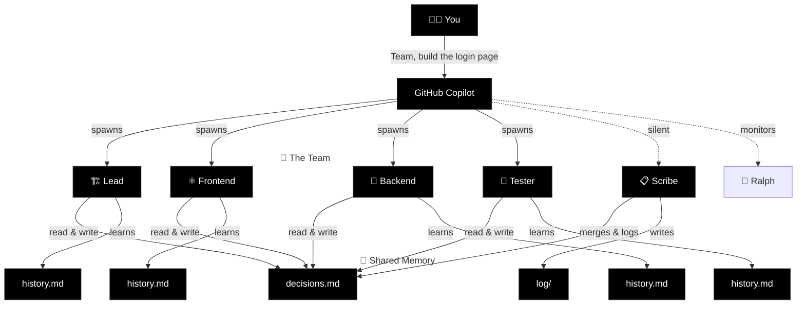

# Squad

**AI agent teams for any project.** A team that grows with your code.

[](#status)
[](#how-it-works)

📣 **[Join the Squad Community](docs/community.md)** — meet contributors, see deployments, share your work.

---

## What is Squad?

Squad gives you an AI development team through GitHub Copilot. Describe what you're building. Get a team of specialists — frontend, backend, tester, lead — that live in your repo as files. They persist across sessions, learn your codebase, share decisions, and get better the more you use them.

It's not a chatbot wearing hats. Each team member runs in its own context, reads only its own knowledge, and writes back what it learned.

> [!IMPORTANT]
> **Ralph's Heartbeat & GitHub Actions Minutes** — We identified that Ralph's heartbeat Action was consuming more GitHub Actions minutes than expected due to its 30-minute cron schedule. **This is now fixed in v0.5.4** — the cron is disabled by default. Run `npx github:bradygaster/squad upgrade` to get the fix. If you have repos where you haven't upgraded yet, please disable the heartbeat workflow or Actions on those repositories until you do. See [#158](https://github.com/bradygaster/squad/issues/158) for details.

---

## Quick Start

### 1. Create your project

```bash
mkdir my-project && cd my-project
git init
```

### 2. Install Squad

```bash
npx github:bradygaster/squad
```

This installs the Squad agent, 10 GitHub Actions workflows for automation (Ralph heartbeat, CI, triage, etc.), templates, and starter skills.

### 3. Authenticate with GitHub (for Issues, PRs, and Ralph)

```bash
gh auth login
```

If you plan to use [Project Boards](docs/features/project-boards.md), add the `project` scope:

```bash
gh auth refresh -s project
```

### 4. Open Copilot and go

```
copilot
```

**In the GitHub Copilot CLI**, type `/agent` and select **Squad (vX.Y.Z)**.  
**In VS Code**, type `/agents` and select **Squad (vX.Y.Z)**.

Then:

```
I'm starting a new project. Set up the team.
Here's what I'm building: a recipe sharing app with React and Node.
```

Squad proposes a team — each member named from a persistent thematic cast. You say **yes**. They're ready.

---

## Agents Work in Parallel — You Catch Up When You're Ready

Squad doesn't work on a human schedule. When you give a task, the coordinator launches every agent that can usefully start — simultaneously. Frontend, backend, tests, architecture — all at once.

```
You: "Team, build the login page"

  🏗️ Lead — analyzing requirements...          ⎤
  ⚛️ Frontend — building login form...          ⎥ all launched
  🔧 Backend — setting up auth endpoints...     ⎥ in parallel
  🧪 Tester — writing test cases from spec...   ⎥
  📋 Scribe — logging everything...             ⎦
```

When agents finish, the coordinator immediately chains follow-up work — tests reveal edge cases, the backend agent picks them up, no waiting for you to ask. If you step away, a breadcrumb trail is waiting when you get back:

- **`decisions.md`** — every decision any agent made, merged by Scribe
- **`orchestration-log/`** — what was spawned, why, and what happened
- **`log/`** — full session history, searchable

**Knowledge compounds across sessions.** Every time an agent works, it writes lasting learnings to its `history.md`. After a few sessions, agents know your conventions, your preferences, your architecture. They stop asking questions they've already answered.

| | 🌱 First session | 🌿 After a few sessions | 🌳 Mature project |
|---|---|---|---|
| ⚛️ **Frontend** | Project structure, framework choice | Component library, routing, state patterns | Design system, perf patterns, a11y conventions |
| 🔧 **Backend** | Stack, database, initial endpoints | Auth strategy, rate limiting, SQL preferences | Caching layers, migration patterns, monitoring |
| 🏗️ **Lead** | Scope, team roster, first decisions | Architecture trade-offs, risk register | Full project history, tech debt map |
| 🧪 **Tester** | Test framework, first test cases | Integration patterns, edge case catalog | Regression patterns, coverage gaps, CI pipeline |
| 📋 **Scribe** | First session logged | Cross-team decisions propagated | Full searchable archive of every session and decision |
| 🔄 **Ralph** | Board check after first batch | Auto-triage, CI monitoring | Continuous backlog processing, zero idle time |

Each agent's knowledge is personal — stored in its own `history.md`. Team-wide decisions live in `decisions.md`, where every agent reads before working. The more you use Squad, the less context you have to repeat.

**And it's all in git.** Anyone who clones your repo gets the team — with all their accumulated knowledge.

---

## How It Works

### The Key Insight

Each agent gets its **own context window**. The coordinator is thin. Each agent loads only its charter + history. No shared bloat.



### Context Window Budget

Real numbers. No hand-waving. Updated as the project grows.

Both Claude Sonnet 4 and Claude Opus 4 have a **200K token** standard context window. Each agent runs in its own window, so the coordinator is the only shared overhead.

| What | Tokens | % of 200K context | When |
|------|--------|--------------------|------|
| **Coordinator** (squad.agent.md) | ~26,300 | 13.2% | Every message |
| **Agent spawn overhead** (charter ~750 + inlined in prompt) | ~750 | 0.4% | When spawned |
| **decisions.md** (shared brain — read by every agent) | ~32,600 | 16.3% | When spawned |
| **Agent history** (varies: 1K fresh → 12K veteran) | ~1,000–12,000 | 0.5–6.0% | When spawned |
| **Total agent load** (charter + decisions + history) | ~34,000–45,000 | 17–23% | When spawned |
| **Remaining for actual work** | **~155,000–166,000** | **78–83%** | Always |

**v0.4.0 context optimization (Feb 2026):** We ran a context budget audit and found `decisions.md` had ballooned to ~80K tokens (40% of context) after 250+ accumulated decision blocks. Combined with spawn template duplication in the coordinator, agents were working with barely half a context window. Three targeted optimizations shipped:

1. **decisions.md pruning** — 251 blocks → 78 active decisions. Stale sprint artifacts, completed analysis docs, and one-time planning fragments archived to `decisions-archive.md`. Nothing deleted — full history preserved.
2. **Spawn template deduplication** — Three near-identical templates (background, sync, generic) collapsed to one. Saved ~3,600 tokens in the coordinator prompt.
3. **Init Mode compression** — 84 lines of first-run-only instructions compressed to 48 lines. Same behavior, less prose.

**Result:** Per-agent spawn cost dropped from 41–46% to 17–23% of context. Agents now have ~78–83% of their context window for actual work, up from ~54–59%. As your squad runs more sessions and accumulates more decisions, Scribe's history summarization keeps per-agent history bounded. For decisions.md, a Scribe-driven automated pruning system is planned for v0.5.0 (see issue #37) — until then, the archive pattern keeps the shared brain lean.

**The architecture still wins.** Each agent runs in **its own** 200K window. The coordinator's window is separate from every agent's window. Fan out to 5 agents and you're working with **~1M tokens** of total reasoning capacity. The per-agent overhead is real but bounded — and the pruning system ensures it stays that way as your project grows.

### Memory Architecture

| Layer | What | Who writes | Who reads |
|-------|------|-----------|-----------|
| `charter.md` | Identity, expertise, voice | Squad (at init) | The agent itself |
| `history.md` | Project-specific learnings | Each agent, after every session | That agent only |
| `decisions.md` | Team-wide decisions | Any agent | All agents |
| `log/` | Session history | Scribe | Anyone (searchable archive) |

---

## What Gets Created

```
.squad/
├── team.md              # Roster — who's on the team
├── routing.md           # Routing — who handles what
├── decisions.md         # Shared brain — team decisions
├── casting/
│   ├── policy.json      # Casting configuration
│   ├── registry.json    # Persistent name registry
│   └── history.json     # Universe usage history
├── agents/
│   ├── {name}/          # Each agent gets a persistent cast name
│   │   ├── charter.md   # Identity, expertise, voice
│   │   └── history.md   # What they know about YOUR project
│   ├── {name}/
│   │   ├── charter.md
│   │   └── history.md
│   └── scribe/
│       └── charter.md   # Silent memory manager
└── log/                 # Session history
```

**Commit this folder.** Your team persists. Names persist. Anyone who clones gets the team — with the same cast.

---

## Growing the Team

### Adding Members

```
> I need a DevOps person.
```

Squad generates a new agent, seeds them with project context and existing decisions. Immediately productive.

### Removing Members

```
> Remove the designer — we're past that phase.
```

Agents aren't deleted. Their charter and history move to `.squad/agents/_alumni/`. Knowledge preserved, nothing lost. If you need them back later, they remember everything.

---

## Reviewer Protocol

Team members with review authority (Tester, Lead) can **reject** work. On rejection, the reviewer may require:

- A **different agent** handles the revision (not the original author)
- A **new specialist** is spawned for the task

The Coordinator enforces this. No self-review of rejected work.

---

## What's New in v0.5.4

### Bug Fixes
- **Ralph heartbeat cron disabled by default** — The 30-minute cron schedule in `squad-heartbeat.yml` was consuming excessive GitHub Actions minutes for users with multiple Squad-enabled repos. The cron is now disabled by default. Ralph still auto-triages on issue close/label and PR close events (zero extra cost). For proactive polling, uncomment the cron in your workflow or use `npx github:bradygaster/squad watch` locally. Run `npx github:bradygaster/squad upgrade` to get the fix. Fixes [#158](https://github.com/bradygaster/squad/issues/158).

<details>
<summary>Previous: v0.5.3</summary>

### Bug Fixes
- **Windows EPERM fallback** — `safeRename()` catches EPERM/EACCES errors (VS Code file watchers hold handles on Windows), falls back to copy+delete. Fixes #135, PR #149.
- **`--version` now shows installed version** — `npx github:bradygaster/squad --version` now shows both the installed Squad version AND the Copilot CLI version on separate lines. Fixes #137, PR #149.
- **Content replacement in migrate-directory** — When migrating from `.ai-team/` to `.squad/`, file contents (not just paths) now get `.ai-team/` references replaced with `.squad/`. Fixes #134, PR #151.

### Behavior Change
- **Guard workflow removed** — The `squad-main-guard.yml` workflow that blocked `.squad/` files from reaching main/preview has been removed. `.squad/` files now flow freely to all branches. Users who want to exclude `.squad/` can use `.gitignore`. Existing installations get the guard auto-deleted on next `squad upgrade` (v0.5.4 migration). Fixes #150, PR #152.

### Community
- Responded to and closed community issues #146, #145, #139
- Filed 4 port issues on squad-pr (#548-551) for cross-repo parity

### Looking Ahead
The next release of Squad will be more significant than prior releases, bringing Squad to NPM for easier installation. The package will still ship from this repository, so existing users will see a transparent change. Issues or PRs filed between now and that release may be held until the next update is complete. We appreciate the community's continued support and look forward to sharing what's coming.

</details>

_See [full release history](docs/whatsnew.md) for all previous versions._

---

---

## Issue Assignment & Triage

Squad integrates with GitHub Issues. Label an issue with `squad` to trigger triage, or assign directly to a member with `squad:{name}`.

### How It Works

1. **Label an issue `squad`** — the Lead auto-triages it: reads the issue, determines who should handle it, applies the right `squad:{member}` label, and comments with triage notes.

2. **`squad:{member}` label applied** — the assigned member picks up the issue in their next Copilot session (or automatically if Copilot coding agent is enabled).

3. **Reassign** — remove the current `squad:*` label and add a different member's label.

### Labels

Labels are auto-created from your team roster via the `sync-squad-labels` workflow:

| Label | Purpose |
|-------|---------|
| `squad` | Triage inbox — Lead reviews and assigns |
| `squad:{name}` | Assigned to a specific squad member |
| `squad:copilot` | Assigned to @copilot for autonomous coding agent work |

Labels sync automatically when `.squad/team.md` changes, or you can trigger the workflow manually.

### Workflows

Squad installs three GitHub Actions workflows:

| Workflow | Trigger | What it does |
|----------|---------|--------------|
| `sync-squad-labels.yml` | Push to `.squad/team.md`, manual | Creates/updates `squad:*` labels from roster |
| `squad-triage.yml` | `squad` label added to issue | Lead triages and assigns `squad:{member}` label |
| `squad-issue-assign.yml` | `squad:{member}` label added | Acknowledges assignment, queues for member |

### Prerequisites

- GitHub Actions must be enabled on the repository
- The `GITHUB_TOKEN` needs `issues: write` and `contents: read` permissions
- For @copilot auto-assign: a classic PAT with `repo` scope stored as `COPILOT_ASSIGN_TOKEN` repo secret (see [setup guide](docs/features/copilot-coding-agent.md#copilot_assign_token-required-for-auto-assign))
- For automated issue work: [Copilot coding agent](https://docs.github.com/en/copilot) must be enabled on the repo

### Session Awareness

The coordinator checks for open `squad:{member}` issues at session start and will mention them: *"Hey {user}, {AgentName} has an open issue — #42: Fix auth endpoint timeout. Want them to pick it up?"*

---


## Install

```bash
npx github:bradygaster/squad
```

> **Appears to hang?** npm resolves `github:` packages via `git+ssh://`. If no SSH agent is running, git prompts for your key passphrase — but npm's progress spinner hides the prompt. Fix: start your SSH agent first (`ssh-add`), or run with `npx --progress=false github:bradygaster/squad` to reveal the prompt. See [Troubleshooting](docs/scenarios/troubleshooting.md) for more.

See [Quick Start](#quick-start) for the full walkthrough.

### Upgrade

Already have Squad? Update Squad-owned files to the latest version without touching your team state:

```bash
npx github:bradygaster/squad upgrade
```

This overwrites `squad.agent.md`, `.ai-team-templates/`, and squad workflow files in `.github/workflows/`. It never touches `.squad/` (or `.ai-team/` for repos that haven't migrated yet) — your team's knowledge, decisions, and casting are safe.

### Migrating to `.squad/`

In v0.5.0, Squad renamed its team state directory from `.ai-team/` to `.squad/`. Existing repos using `.ai-team/` continue to work — Squad detects both and shows a deprecation warning if you're still on `.ai-team/`.

**To migrate (two steps):**

```bash
# Step 1: Upgrade to get the migration command
npx github:bradygaster/squad upgrade

# Step 2: Rename the directory
npx github:bradygaster/squad upgrade --migrate-directory
```

Then commit your changes:

```bash
git add -A
git commit -m "chore: migrate .ai-team/ → .squad/"
```

**What the migration does:**
- Renames `.ai-team/` → `.squad/`
- Updates `.gitignore` and `.gitattributes` references
- Scrubs email addresses from migrated files (PII cleanup)

**Timeline:** `.ai-team/` is supported through v0.6.0. Migration becomes required in v1.0.0.

**Safety:** Migration is safe and reversible with `git revert`. Full details in [Migration Guide](docs/migration/v0.5.0-squad-rename.md).

### Insider Program

Want the absolute latest features before they ship? Join the **Insider Program** to run pre-release builds from the `dev` branch.

**Install the insider build:**

```bash
npx github:bradygaster/squad#insider
```

**Upgrade an existing squadified repo to insiders:**

```bash
npx github:bradygaster/squad#insider upgrade
```

The upgrade command updates Squad-owned files (`squad.agent.md`, workflows, templates) to the latest insider build. Your team state — `.squad/` including `team.md`, agents, decisions, and casting configuration — is always preserved.

**What to expect:** Insider builds may be unstable. They're intended for early adopters, testing, and feedback. New features ship as you code; breaking changes are rare but possible.

**Releases:** The insider release workflow creates GitHub Releases with pre-release tags (e.g., `v0.4.2-insider+abc1234`). To pin a specific tagged version:

```bash
npx github:bradygaster/squad#v0.4.2-insider+<sha>
```

**Learn more:** See the [insider branch](https://github.com/bradygaster/squad/tree/insider) for the latest code. Report bugs in [CONTRIBUTORS.md](CONTRIBUTORS.md).

---

## Known Limitations

- **Experimental** — API and file formats may change between versions
- **Node 22+** — requires Node.js 22.0.0 or later (`engines` field enforced)
- **GitHub Copilot CLI & VS Code** — Squad is fully supported on CLI and VS Code (v0.4.0+). For platform-specific feature support (model selection, background mode, SQL tool access), see [Client Compatibility Matrix](docs/scenarios/client-compatibility.md)
- **`gh` CLI required** — GitHub Issues, PRs, Ralph, and Project Boards all need `gh auth login`. Project Boards additionally require `gh auth refresh -s project`
- **Knowledge grows with use** — the first session is the least capable; agents improve as they accumulate history
- **SSH agent required for install** — `npx github:bradygaster/squad` resolves via `git+ssh://`. If no SSH agent is running, npm's progress spinner hides git's passphrase prompt, making install appear frozen. Fix: start your SSH agent first (`ssh-add`), or use `npx --progress=false github:bradygaster/squad`. See [#30](https://github.com/bradygaster/squad/issues/30)

---

## Known Issues

These are known platform-level issues affecting the Squad experience. They're not Squad bugs — they originate in the Copilot CLI runtime — but Squad includes mitigations.

| Issue | Symptom | Status |
|-------|---------|--------|
| **`--no-warnings` error** | `error: unknown option '--no-warnings'` appears during agent sessions | Platform bug — the Copilot CLI passes `--no-warnings` to a subprocess that doesn't recognize it. Cosmetic only; does not affect functionality. |
| **Server error retry loop** | `"response was interrupted due to a server error. retrying"` followed by `"failed to get response from the AI model"` | Context overflow during multi-agent fan-out. Squad v0.5.0 reduces governance prompt size by ~35% and adds compact result presentation to mitigate. |
| **Silent success** (~7-10% of spawns) | Agent completes all file writes but returns no text response | Platform bug — agent's final turn is a tool call, not text. Squad detects this via filesystem checks and reports `"⚠️ completed (files verified) but response lost."` |

**Workarounds:**
- If you hit the server error loop, start a new session. The work likely completed — check `.squad/` for recent changes.
- The `--no-warnings` error is cosmetic and can be safely ignored.

---

## Status

🟣 **Experimental** — v0.5.4. Contributors welcome.

Conceived by [@bradygaster](https://github.com/bradygaster).

---

## Sprint 0 — Supervisor + Event Bus PoC

This section documents how to run the Squad Next Supervisor and Redis Streams event bus PoC introduced in Sprint 0 PR1.

### Required Environment Variables

| Variable | Default | Description |
|---|---|---|
| `REDIS_URL` | `redis://localhost:6379` | Redis connection URL for the event bus |
| `REDISGRAPH_URL` | *(none)* | Redis Graph URL for memory layer (PR2) |
| `FAISS_PATH` | *(none)* | FAISS vector service URL for embeddings (PR2) |
| `EMBEDDING_MODEL` | *(none)* | OpenAI-compatible embedding model name (PR2) |
| `SUPERVISOR_PORT` | `3000` | HTTP port for the supervisor `/health` endpoint |

### Running the PoC via Docker Compose

```bash
# Build and start the full PoC stack (supervisor, redis, redisgraph, faiss placeholder, agent placeholder)
docker compose -f docker-compose.poc.yml up --build

# Run in detached mode
docker compose -f docker-compose.poc.yml up --build -d
```

### Verifying the Health Endpoint

```bash
# Once the supervisor container is running:
curl http://localhost:3000/health
# Expected response (HTTP 200):
# {"status":"ok","agents":[]}
```

### Running the Supervisor Locally (without Docker)

```bash
# Requires: npm install, a running Redis instance
REDIS_URL=redis://localhost:6379 SUPERVISOR_PORT=3000 node index.js watch --supervisor

# Or use npm script directly:
npm run supervisor
```

### Running Supervisor Tests

```bash
# Run only the supervisor + event bus unit tests (no Redis required — fully mocked):
npm run test:supervisor

# Run all tests:
npm test
```

### Testing Event Flow on Redis Streams

With the PoC stack running (`docker compose -f docker-compose.poc.yml up`):

```bash
# Connect to Redis CLI
docker compose -f docker-compose.poc.yml exec redis redis-cli

# Watch events arriving on the work:new stream
XREAD COUNT 10 BLOCK 0 STREAMS work:new $

# Publish a test event manually
XADD work:assign * type work:assigned agent alice issue 42

# Check all messages on a stream
XRANGE work:new - +
XRANGE work:assign - +
XRANGE work:done - +
XRANGE memory:changed - +
```

### Architecture Notes (Sprint 0)

- **`src/lib/redisStreams.ts`** — lightweight Redis Streams abstraction supporting publish/consume/ensureGroup for topics `work:new`, `work:assign`, `work:done`, `memory:changed`.
- **`src/supervisor/index.ts`** — supervisor daemon: HTTP `/health` endpoint, structured JSON heartbeat logs (with `trace_id`, `agent`, `action`, `duration_ms`), restart policy scaffold, event bus integration.
- **`Dockerfile.supervisor`** — production-ready container image for the supervisor service.
- **`docker-compose.poc.yml`** — PoC compose stack; graph memory (PR2) and embedding service (PR2) are scaffolded as placeholders.

### Stopping the PoC Stack

```bash
docker compose -f docker-compose.poc.yml down
```
